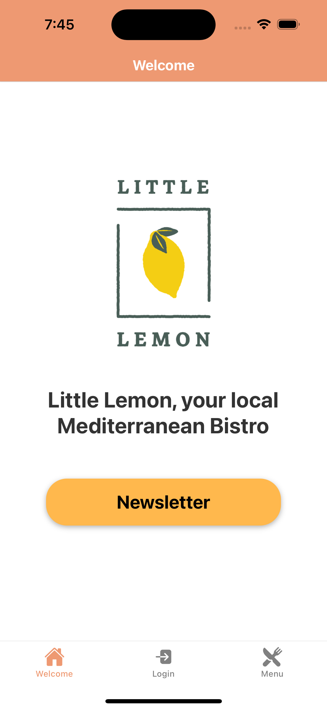
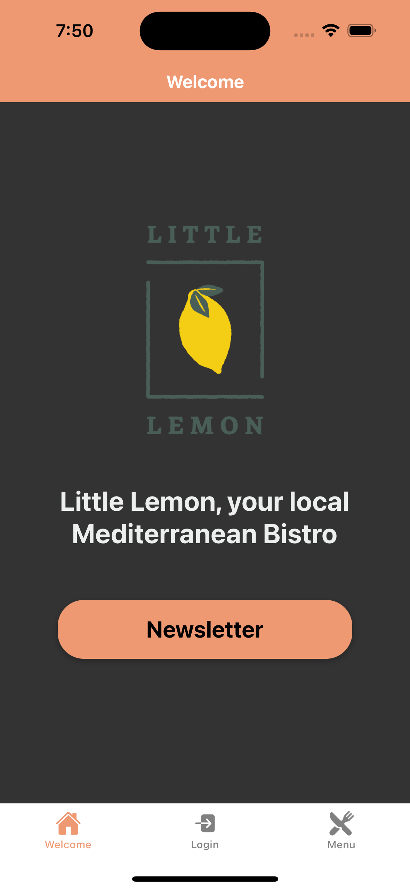
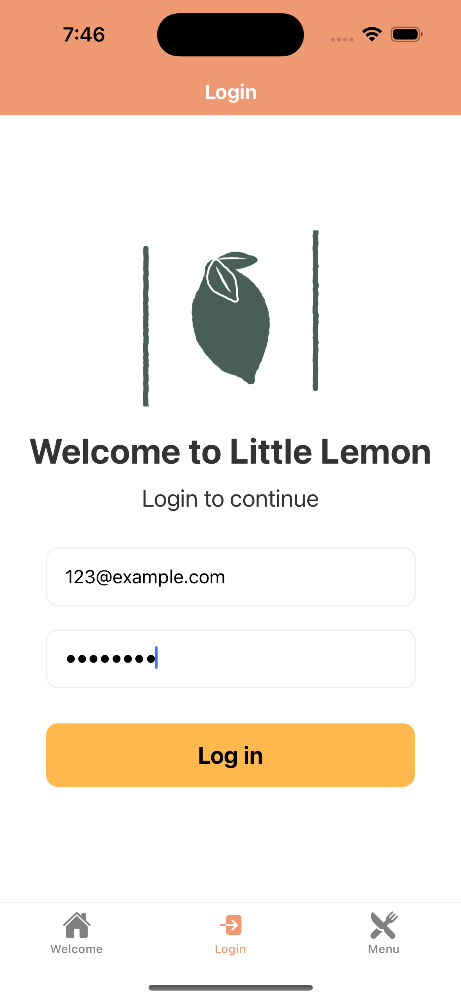
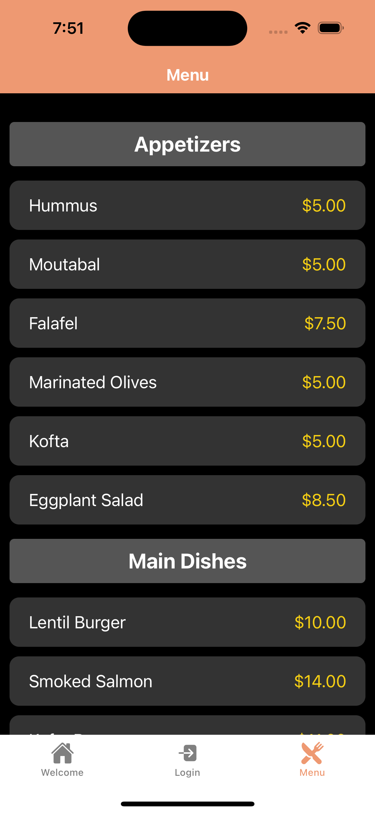
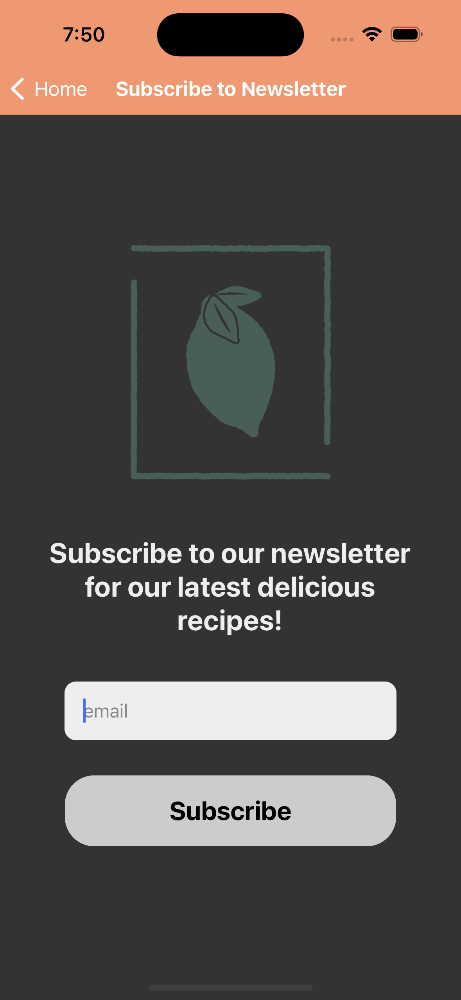
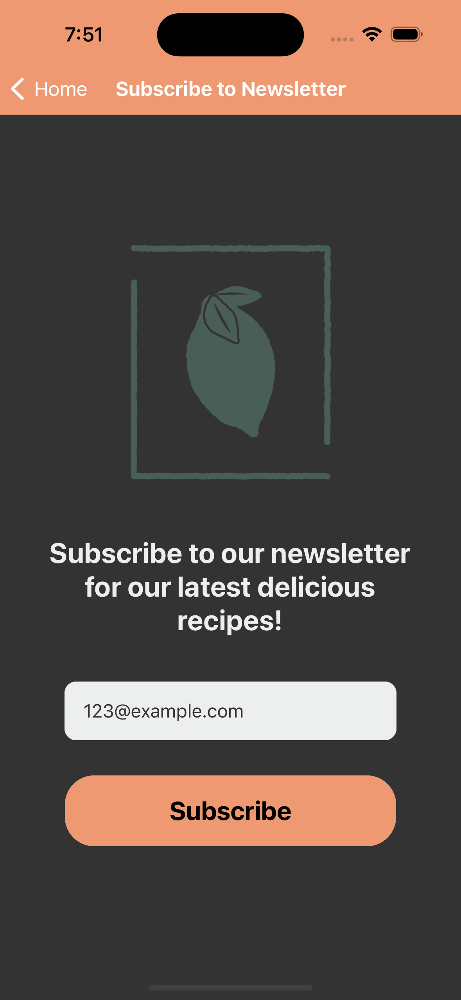
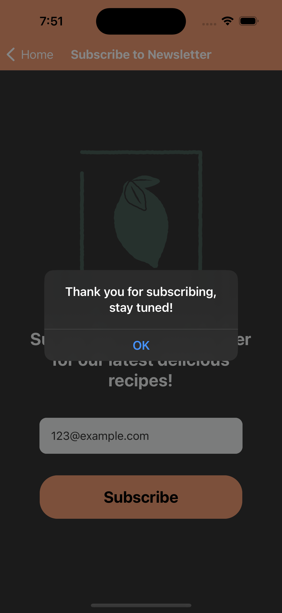

# Little Lemon App

## Project Overview
The Little Lemon App is a cross-platform mobile application built with **React Native** and **Expo**. This app is designed to showcase a Mediterranean bistro's brand and offer a seamless experience through multiple screens, including a Welcome page, Login page, Menu items list, and a Subscription page. The app integrates both **Stack Navigation** and **Tab Navigation** to ensure a smooth and user-friendly experience.

This project is an extension of the coursework from the **Coursera Meta Professional Certificate in iOS Development**. While inspired by the course material, this app incorporates unique design choices, additional features, and custom UI elements, demonstrating advanced skills beyond the original coursework.

## 📱 App Screenshots
- Welcome Screen


- Login Screen


- Menu Items Screen


- Subscription Screen






## 🚀 Features
- **Tab Navigation:** Provides easy access to the `Welcome`, `Login`, and `Menu` screens.
- **Stack Navigation:** Allows seamless navigation to the `Subscribe` screen.
- **Dark and Light Mode Support:** Automatically adapts to the system theme.
- **Responsive UI:** The app uses `KeyboardAvoidingView` to ensure content is not blocked by the keyboard.
- **Validation:** The subscription form includes email validation.

## 🛠️ Technologies and Tools
- **React Native & Expo:** For building and testing the mobile app.
- **React Navigation:** Utilizing both **Stack** and **Tab** navigators.
- **Ionicons:** Providing consistent and visually appealing icons.
- **React Hooks:** Managing state with **useState** and theme detection with **useColorScheme**.
- **UI Components:** Using **ScrollView**, **TextInput**, and **Pressable** to build an interactive interface.

## 🔧 Installation and Setup
1. **Clone the repository:**
```bash
git clone https://github.com/yourusername/little-lemon-app.git
```
2. **Navigate to the project directory:**
```bash
cd little-lemon-app
```
3. **Install dependencies:**
```bash
npm install
```
4. **Start the Expo server:**
```bash
npx expo start
```
5. **Run the app:**
- On your phone using the **Expo Go app**.
- On an emulator (iOS/Android) directly from Expo DevTools.

## 🎨 UI/UX Highlights
- **Dark Mode:** Text and background colors adapt to system settings.
- **Modern Design:** Clean and consistent styling with custom buttons and input fields.
- **User Feedback:** Alerts on successful subscription and login status.

## 💡 Potential Enhancements
- **Add Authentication:** Implement login with a backend service.
- **Dynamic Menu:** Load menu items from an API.

## 📂 Project Structure
```
├── assets
│   └── images
│       ├── little-lemon-logo.png
│       ├── little-lemon-logo-grey.png
│       └── screenshots
│           ├── welcome.png
│           ├── login.png
│           ├── menu.png
│           └── subscribe.png
├── components
├── navigators
│   └── RootNavigator.js
├── screens
│   ├── WelcomeScreen.js
│   ├── LoginScreen.js
│   ├── MenuItems.js
│   └── SubscribeScreen.js
├── App.js
└── app.json
```
